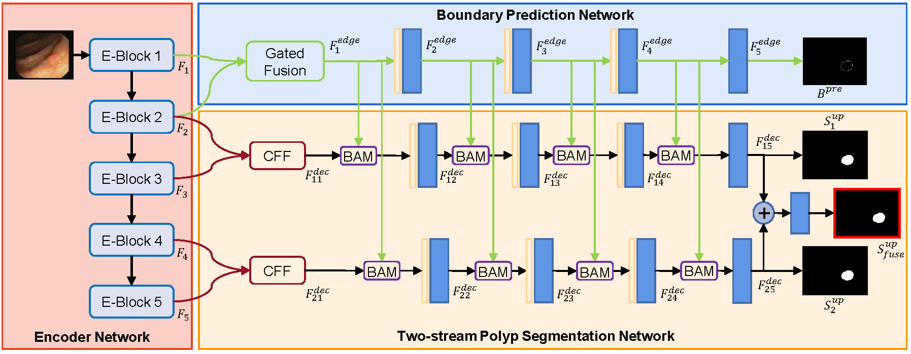

# Cross-level Feature Aggregation Network for Polyp Segmentation

> **Authors:** 
> [Tao Zhou](https://taozh2017.github.io/),
> [Yi Zhou](https://cse.seu.edu.cn/2021/0303/c23024a362239/page.htm), 
> [Kelei He](https://scholar.google.com/citations?user=0Do_BMIAAAAJ&hl=en), 
> [Chen Gong](https://gcatnjust.github.io/ChenGong/index.html), 
> [Jian Yang](https://scholar.google.com/citations?user=6CIDtZQAAAAJ&hl=en), 
> [Huazhu Fu](http://hzfu.github.io/), and
> [Dinggang Shen](https://scholar.google.com/citations?user=v6VYQC8AAAAJ&hl=en).

## 1. Preface

- This repository provides code for "_**Cross-level Feature Aggregation Network for Polyp Segmentation (CFANet)**_". 
([paper](https://www.sciencedirect.com/science/article/pii/S0031320323002558))

- If you have any questions about our paper, feel free to contact me. And if you are using CFANet for your research, please cite this paper ([BibTeX](#4-citation)).

### 1.1. :fire: NEWS :fire:

- [2023/05/20] Release training/testing code.

- [2020/05/10] Create repository.

### 2.1. Table of Contents

- [Cross-level Feature Aggregation Network for Polyp Segmentation]
  - [2. Overview](#2-overview)
    - [2.1. Introduction](#21-introduction)
    - [2.2. Framework Overview](#22-framework-overview)
    - [2.3. Qualitative Results](#23-qualitative-results)
  - [3. Proposed Baseline](#3-proposed-baseline)
    - [3.1. Training/Testing](#31-trainingtesting)
    - [3.2 Evaluating your trained model:](#32-evaluating-your-trained-model)
    - [3.3 Pre-computed maps:](#33-pre-computed-maps)
  - [4. MindSpore](#4-mindspore)
  - [5. Citation](#5-citation)
  - [6. License](#6-license)

<small><i><a href='http://ecotrust-canada.github.io/markdown-toc/'>Table of contents generated with markdown-toc</a></i></small>

## 2. Overview

### 2.1. Introduction

Accurate segmentation of polyps from colonoscopy images plays a critical role in the diagnosis and cure of colorectal cancer. Although effectiveness has been achieved in the field of polyp segmentation, there are still several challenges. Polyps often have a diversity of size and shape and have no sharp boundary between polyps and their surrounding. To address these challenges, we propose a novel Cross-level Feature Aggregation Network (CFA-Net) for polyp segmentation. Specifically, we first propose a boundary prediction network to generate boundary-aware features, which are incorporated into the segmentation network using a layer-wise strategy. In particular, we design a two-stream structure based segmentation network, to exploit hierarchical semantic information from cross-level features. Furthermore, a Cross-level Feature Fusion (CFF) module is proposed to integrate the adjacent features from different levels, which can characterize the cross-level and multi-scale information to handle scale variations of polyps. Further, a Boundary Aggregated Module (BAM) is proposed to incorporate boundary information into the segmentation network, which enhances these hierarchical features to generate finer segmentation maps. Quantitative and qualitative experiments on five public datasets demonstrate the effectiveness of our CFA-Net against other state-of-the-art polyp segmentation methods

### 2.2. Framework Overview

      
    <em> 
    Figure 1: Overview of the proposed CFANet.
    </em>

### 2.3. Qualitative Results

      
    <em> 
    Figure 2: Qualitative Results.
    </em>

## 3. Proposed Baseline

### 3.1. Training/Testing

The training and testing experiments are conducted using [PyTorch](https://github.com/pytorch/pytorch) with 
a single NVIDIA Tesla P40 with 24 GB Memory.

> Note that our model also supports low memory GPU, which means you can lower the batch size

1. Configuring your environment (Prerequisites):
   
    Note that CFANet is only tested on Ubuntu OS with the following environments. 
    It may work on other operating systems as well but we do not guarantee that it will.
    
    + Creating a virtual environment in terminal: `conda create -n CFANet python=3.6`.
    
    + Installing necessary packages: PyTorch 1.1

1. Downloading necessary data:

    + downloading testing dataset and move it into `./data/TestDataset/`, 
    which can be found in this [download link (OneDrive)](https://anu365-my.sharepoint.com/:u:/g/personal/u7248002_anu_edu_au/ESYGBNkhTrJPqW-hq7axGsgBqG50IBcTlrkRnljD9iJuuw?e=1rkTSq). It contains five sub-datsets: CVC-300 (60 test samples), CVC-ClinicDB (62 test samples), CVC-ColonDB (380 test samples), ETIS-LaribPolypDB (196 test samples), Kvasir (100 test samples).
    
    + downloading training dataset and move it into `./data/TrainDataset/`, 
    which can be found in this [download link (Google Drive)](https://drive.google.com/file/d/1hzS21idjQlXnX9oxAgJI8KZzOBaz-OWj/view?usp=sharing). It contains two sub-datasets: Kvasir-SEG (900 train samples) and CVC-ClinicDB (550 train samples).
    
    + downloading pretrained weights and move it into `checkpoint/CFANet.pth`, 
    which can be found in this [download link (Google Drive)](https://drive.google.com/file/d/1pgvgYebjVVm-QZN-VbGdtYmAyccQmKxZ/view?usp=sharing).
    
    + downloading Res2Net weights and and move it into `./lib/`, 
    which can be found in this [download link (Google Drive)](https://drive.google.com/file/d/1_1N-cx1UpRQo7Ybsjno1PAg4KE1T9e5J/view?usp=sharing).
   
1. Training Configuration:

    + Assigning your costumed path, like `--save_model` and `--train_path` in `train.py`.
    
    + Just enjoy it!

1. Testing Configuration:

    + After you download all the pre-trained model and testing dataset, just run `test.py` to generate the final prediction map: 
    replace your trained model directory (`--pth_path`).
    
    + Just enjoy it!

### 3.2 Evaluating your trained model:

Matlab: One-key evaluation is written in MATLAB code ([link](https://drive.google.com/file/d/1_h4_CjD5GKEf7B1MRuzye97H0MXf2GE9/view?usp=sharing)), 
please follow this the instructions in `./eval/main.m` and just run it to generate the evaluation results in `./res/`.
The complete evaluation toolbox (including data, map, eval code, and res): [new link](https://drive.google.com/file/d/1bnlz7nfJ9hhYsMLFSBr9smcI7k7p0pVy/view?usp=sharing). 

### 3.3 Pre-computed maps: 
They can be found in [download link]().

## 4. MindSpore

You need to run `cd mindspore` first.

1. Environment Configuration:

    + MindSpore: 2.0.0-alpha

    + Python: 3.8.0

5. Training Configuration:

    + Assigning your costumed path, like `--save_model` , `--train_img_dir` and so on in `train.py`.
    
    + Just enjoy it!

6. Testing Configuration:

    + After you download all the pre-trained model and testing dataset, just run `test.py` to generate the final prediction map: 
    replace your trained model directory (`--pth_path`).
    
    + Just enjoy it!

## 5. Citation

Please cite our paper if you find the work useful: 
    
    @article{fan2020pranet,
      title={Cross-level Feature Aggregation Network for Polyp Segmentation},
      author={Zhou, Tao and Zhou, Yi and He, Kelei and Gong, Chen and Yang, Jian and Fu, Huazhu and Shen, Dinggang},
      journal={Pattern Recognition},
      volume={140},
      pages={109555},
      year={2023},
      publisher={Elsevier}
    }

## 6. License

The source code is free for research and education use only. Any comercial use should get formal permission first.

---

**[⬆ back to top](#0-preface)**
